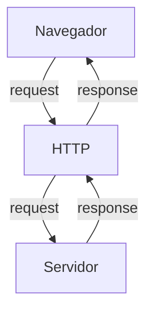
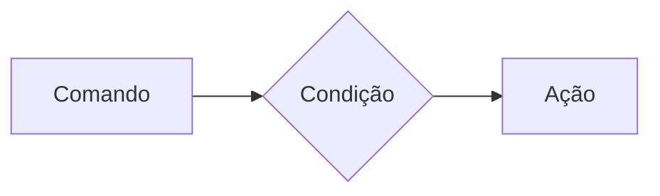
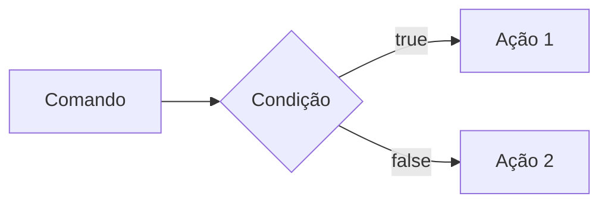

# **Curso BackEnd - 225h - Técnico em Desenvolvimento de Sistemas - SENAI**

Profº Diogo TB

Escola SENAI Americana

2º Semestre 2026

## Objetivos do Curso

- Desenvolver Aplicações web Server Side, utilizando a linguagem PHP;
- Aplicar Sintaxe Nativa PHP (Vanilla);
- Manipulação HTTP;
- Persistência de Dados;
- Segurança contra SQL Injection/CSRF;
- Refatoração em POO (Programação Orientada ao Objeto);
- Arquitetura MVC (Model, View, Controller);
- Utilização do FrameWork Laravel;

OBS: FrameWork -> um conjunto de bibliotecas que oferecem uma solução completa para o desenvolvimento de alguma coisa.

## Cronograma do Semestre

Carga Horária: 105h 1º Semestre e 120h 2º Semestre

Duração: 20 Semanas 1º Semestre e 20 Semanas 2º Semestre

---

### Semana 1: Introdução ao BackEnd e Configuração do Ambiente PHP

#### O que é BackEnd?

O BackEnd é a parte de uma aplicação que o usuário não vê, mas que faz tudo funcionar por trás das telas.

O BackEnd é a parte de um sistema que funciona nos servidores, sendo responsável por executar a lógica da aplicação, processar informações e armazenar dados.

Além disso, o BackEnd é responsável por atender ás solicitações do Frontend.

Sobre o mercado atual: o cenário é bom, mas mais exigente do que era. Quem conhece só o básico enfrenta mais concorrência. Quem alia backend sólido com IA aplicada, cloud e inglês está num patamar completamente diferente — vagas internacionais remotas são uma realidade pra esse perfil.

O Backend é formado pelo servidor, banco de dados, lógica de programação com APIs e linguagens de programação/frameworks. Esses componentes trabalham juntos para processar dados, armazenar informações e garantir o funcionamento da aplicação.

### Para que serve
- Processar lógica de negócio: regras, cálculos, validações (ex: calcular frete, aplicar desconto, validar login)

- Gerenciar banco de dados: salvar, buscar, atualizar e deletar informações

- Autenticação e autorização: controlar quem pode acessar o quê (login, senhas, permissões)

- Fornecer APIs: criar "pontes" (endpoints) para o frontend ou outros sistemas consumirem dados

- Integração com serviços externos: pagamentos, e-mails, notificações, APIs de terceiros

- Segurança: proteger dados sensíveis, evitar ataques (SQL injection, XSS, etc.)

- Escalabilidade e performance: garantir que o sistema aguente muitos usuários ao mesmo tempo.

### Principais Tecnologias Linguagens de programação: 
 Ferramentas usadas para escrever o código do servidor, como Python, Node.js (JavaScript), Java e PHP.APIs: Os "caminhos" que permitem que o que você vê no celular converse com o servidor.

### Setores que mais contratam
- Fintechs e Bancos:
Segurança, transações, alta escala 

- E-commerce:
Catálogo, pedidos, pagamentos

- Healthtechs:
Prontuários, telemedicina

- SaaS / Startups:
Backend é o coração do produto

- Logística:
Rastreio, rotas, tempo real

- Educação:
Plataformas, conteúdo, usuários

### O Ciclo de Vida da Requisição HTTP

##### O que é HTTP?

*HTTP*, Hypertext Transfer Protocol, é um protocolo de comunicação utilizado para transferência de informações na WWW (World Wide Web) e em outros sistemas de redes.

O HTTP é a base para que o cliente e um servidor web troquem informações. Ele permite a requisição e a resposta de recursos como, imagens, arquivos e textos.



#### Como Funciona na Prática o BackEnd

- **Ação do Usuário**: Envia uma solicitação pela UI(Interface do Usuário). Exemplo de UI: Tela do celular, navegador da internet, Alexa, IOT ...
- **Enviar uma requisição**: A UI transforma a ação do Usuário em uma requisição HTTP.
- **O processamento BackEnd**: O código BackEnd recebe o pedido, valida os dados e decide o que fazer. Ex: consultar uma informação no BD(Banco de dados).
- **Resposta**: O servidor devolve o resultado para a UI. Ex: Um login autorizado, confirmação de uma compra...

#### Tipos de requisição HTTP

Os tipos de requisição HTTP indicam a ação que o usuário deseja executar no servidor. As principais ações são:

- **GET**: Pede dados de um lugar especifico do servidor. "Não faz alterações no servidor"
- **DELETE**: Apaga um dado do servidor.
- **POST**: Envia dados novos para **criar** algo ou processar informações do servidor.
- **PUT/PATCH**: Modificar um dado já existente.

---

### Iniciando o PHP

**PHP** (HyperText PreProcessor) é uma linguagem de programação interpretada e open source, focada no desenvolvimento de sistemas para web, que pode ser usada junto com HTML para criação de páginas web dinâmicas.

O PHP de fato é uma das linguagens de programação mais populares da atualidade. Ela permite que você crie aplicações web robustas, de uma maneira muito simplificada e direta. A linguagem tem diversos recursos que facilitam e aceleram o processo de desenvolvimento de sites e sistemas para web. E além do mais, ela ainda tem um ótimo ecossistema, uma excelente comunidade e um grande mercado de trabalho.

#### Instalando o PHP

- Fazer o Download do PHP (php.net)
- ZIP - NTS(Non Thread Safe) 8.5
- Descompactar o arquivo do PHP na pasta C:\src\php (Para descompactar usar o 7zip = Melhor e mais rapido) => Nunca salvar arquivo ou programas na raiz do sistema(C:)
- Adicionar a pasta do PHP(C:\src\php) as variáveis de ambiente do sistema (PATH)
- Verificar a instalação rodando o comando 
> *php --version*

#### Criando minha primeira aplicação em PHP

1. Antes de começar a codar:

- Preparar meu VSCODE
    - Criar um Profile próprio para PHP.
    - Instalar extensões necessárias para transformar o VSCODE em uma IDE.
        - PHP Intelephense -> Permite a utilização de Snippets(Atalhos de código)
        - PHP Debug -> Ajuda a encontrar erros de código
        - PHP Cs fixer -> Formatação de códigos (Identação)
        - PHP Server -> Ajuda na criação de um servidor local para PHP
    - Desabilitamos o PHP Nativo do VSCODE (@builtin PHP)

2. Hello World (Muito importante)

### Semana 2 - Variáveis, constantes e operadores em PHP

##### Estudo de variáveis e constantes em PHP

Declarar variáveis é alocar um espaço na memória que permite a inclusão e manipulação de dados.

**Variáveis** 

- Devem ser declaradas usando "$" antes do nome da variável
- São não tipadas (não precisa declarar o tipo dela na criação) 
- Podem ser String, Numéricas (interger e float) e Booleanas e Nulas. Não permite declaração de Undefined
- Regra de ouro: Usar o "declare(strict_types=1);" na primeira linha do arquivo; => Blinda o sistema contra conflitos de tipos de variáveis 

**Constantes**

- Não podem ser mudadas ou redeclaradas após a criação
- Pode ser criadas usando o "const" ou o "define"
- Não permite interpolação

##### Estudo de operadores

**Aritméticos**: São usados para realizar cálculos

|Operador | Nome | Exemplo | Resultado |
| - | - | - | - |
| + | Adição | 10+5 | 15 |
| - | Subtração | 10-5 | 5 |
| * |Multiplicação | 10*5 | 50 |
| / | Divisão | 10/5 | 2 |
| % | Modulo(Resto) | 10%3 | 1 (10 div 3 da 3, sobra 1) |
| ** | Expoente | 2**3 | 8 (2 elevado a 3) |
 obs: O operador & é o melhor amigo de um programador, permite ordenar listas e organizar fila e pilhas

**Relacionais**:  Permite o relacionamento entre dois ou mais valores, o resultado de uma operação é sempre uma booleana (True or False).

| Operador | Significado | Exemplo | Resultado |
| - | - | - | - |
| > | Maior que | 18 > 18 | False |
| >= | Maior ou igual a | 18 >= 18 | True |
| < | Menor que | 10 < 20 | True |
| <= | Menor ou igual a | 10 <= 5 | False |
| == | Comparação de valor | "10" == 10 | True |
| === | Comparação estrita | "10" === 10 | False |
| != | Diferente | "10" != 10 | False |
| !== | Estritamente diferente | "10" !== 10 | True |


**Lógicos**: Permite a combinação entre sentenças. 

- Operador AND (E) => && : para o resultado ser verdadeiro, todas as combinações precisam ser verdadeiras
    - True && True = True
    - True && True = False

- Operador OR (OU) => || : para o resultado ser verdadeiro, basta apenas uma condição ser verdadeira
    - False || True = True
    - False || False = False

- Operador NOT (NÃO) => ! : inverte a lógica da operação
    - !True = False
    - !False = True
    
---

### Semana 3 - Estrutura de controle de dados (Condicionais e repetição)

- **Conteúdo**: Estrutura `if`, `else`, `elseif`, operadores ternários, `match` => substituto do `switch/case`, loops `for`, `while`, `do-while` e `foreach`

#### Estruturas de controle de dados ajudam no processo de automatização em programas e sistemas

##### Condicionais (IF, ELSE, ELSEIF)

**Formas de uso**

- uso do `if` apenas:
Exemplo: aplicar desconto de 10% em compras acima de R$ 100;


```php
if($valorCompra > 100) {
    $valorFinal = $valorCompra * 0.9;
}
```

- Uso do `if` e do `else`
Exemplo: Aplicar um desconto de 10% para compras acima de 100 reais e 5% para as demais compras



```php

if($valorCompra > 100){
    $valorFinal = $valorCompra * 0.9;
} else {
    $valorFinal = $valorCompra * 0.95;
}


```